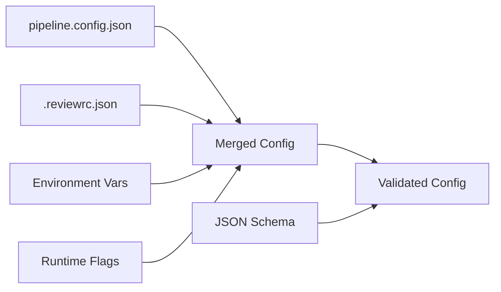
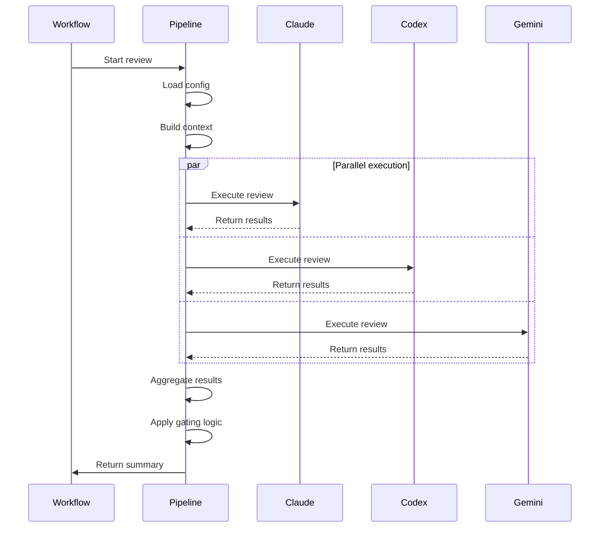
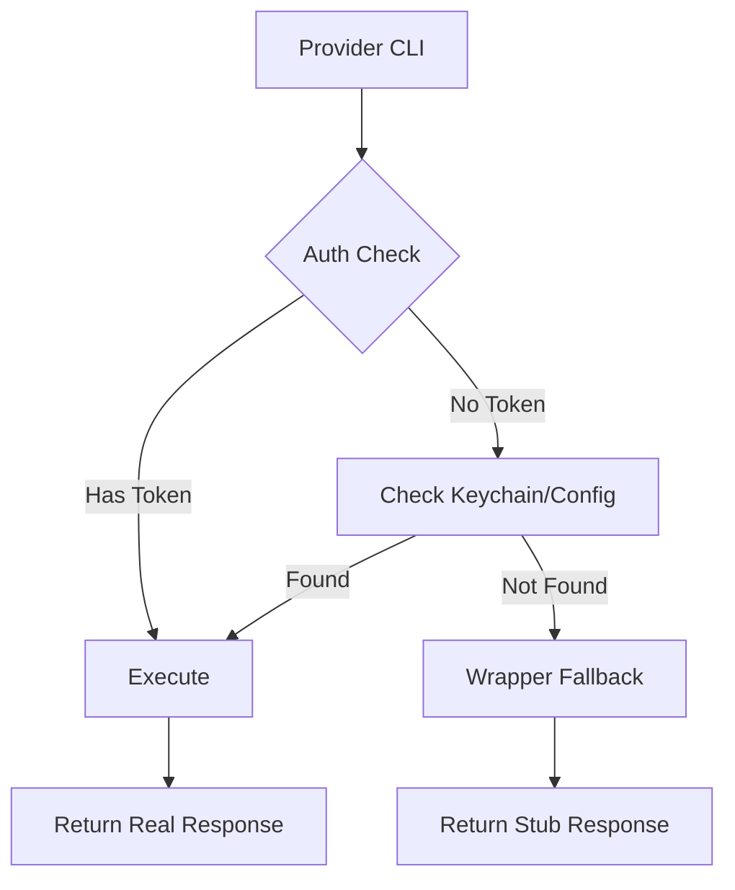

# Multi-Model Review Pipeline Architecture

## Overview

The Multi-Model Review Pipeline is a distributed system that orchestrates code reviews across multiple AI providers (Claude, Codex, Gemini) using a self-hosted GitHub Actions runner with local authentication.

## System Architecture

```
┌────────────────────────────────────────────────────────────────────┐
│                         GitHub Repository                          │
│  ┌──────────────────────────────────────────────────────────────┐ │
│  │                    Pull Request Trigger                       │ │
│  └────────────────────────┬──────────────────────────────────────┘ │
│                           │                                        │
│  ┌────────────────────────▼──────────────────────────────────────┐ │
│  │              GitHub Actions Workflow (.yml)                   │ │
│  │  • Checkout code                                              │ │
│  │  • Build context (diff, tests)                                │ │
│  │  • Call review pipeline                                       │ │
│  └────────────────────────┬──────────────────────────────────────┘ │
└───────────────────────────┼────────────────────────────────────────┘
                            │ Dispatches job to
                            ▼
┌────────────────────────────────────────────────────────────────────┐
│                    Self-Hosted Runner (macOS)                      │
│  ┌──────────────────────────────────────────────────────────────┐ │
│  │                  GitHub Runner Service                        │ │
│  │  • Polls for jobs                                             │ │
│  │  • Sets up workspace                                          │ │
│  │  • Executes workflow steps                                    │ │
│  └────────────────────────┬──────────────────────────────────────┘ │
│                           │                                        │
│  ┌────────────────────────▼──────────────────────────────────────┐ │
│  │              Review Pipeline Package (npm)                    │ │
│  │  ┌──────────────────────────────────────────────────────┐    │ │
│  │  │             Configuration Loader                      │    │ │
│  │  │  • Loads .reviewrc.json                              │    │ │
│  │  │  • Merges with defaults                              │    │ │
│  │  │  • Validates schemas                                 │    │ │
│  │  └──────────────────┬───────────────────────────────────┘    │ │
│  │                      │                                        │ │
│  │  ┌──────────────────▼───────────────────────────────────┐    │ │
│  │  │             Provider Orchestrator                    │    │ │
│  │  │  • Parallel/sequential execution                     │    │ │
│  │  │  • Timeout management                                │    │ │
│  │  │  • Error handling                                    │    │ │
│  │  └──────────┬────────────────┬──────────────┬───────────┘    │ │
│  │             │                │              │                 │ │
│  │  ┌──────────▼──┐  ┌──────────▼──┐  ┌────────▼──┐            │ │
│  │  │Claude Worker│  │Codex Worker │  │Gemini Work│            │ │
│  │  └──────┬──────┘  └──────┬──────┘  └──────┬────┘            │ │
│  └─────────┼─────────────────┼────────────────┼──────────────────┘ │
│            │                 │                │                    │
│  ┌─────────▼─────────────────▼────────────────▼─────────────────┐ │
│  │                     Provider CLIs                             │ │
│  │  ┌──────────────┐  ┌──────────────┐  ┌──────────────┐      │ │
│  │  │  Claude Code │  │  Codex CLI   │  │  Gemini CLI  │      │ │
│  │  └──────┬───────┘  └──────┬───────┘  └──────┬───────┘      │ │
│  └─────────┼──────────────────┼─────────────────┼───────────────┘ │
│            │                  │                 │                  │
│  ┌─────────▼──────────────────▼─────────────────▼───────────────┐ │
│  │              Authentication Layer (OAuth/Keychain)            │ │
│  │  • macOS Keychain for Claude                                  │ │
│  │  • OAuth tokens for Codex/Gemini                              │ │
│  │  • No API keys in environment                                 │ │
│  └──────────────────────────────────────────────────────────────┘ │
└────────────────────────────────────────────────────────────────────┘
```

## Component Details

### 1. GitHub Repository Layer

**Components:**
- Pull Request triggers
- GitHub Actions workflow files
- Repository configuration

**Responsibilities:**
- Trigger reviews on PR events
- Store project configuration (`.reviewrc.json`)
- Define project-specific criteria (`.review-criteria.md`)

**Key Files:**
```
repository/
├── .github/workflows/pr-review.yml  # Workflow definition
├── .reviewrc.json                   # Review configuration
└── .review-criteria.md              # Project-specific criteria
```

### 2. Review Pipeline Package

**Components:**
- Configuration loader with schema validation
- Provider orchestrator for parallel execution
- Command builder for secure execution
- Result aggregator with gating logic

**Architecture:**
```
review-pipeline/
├── bin/
│   └── review-pipeline          # CLI entry point
├── lib/
│   ├── index.js                # Main API
│   ├── config-loader.js        # Configuration management
│   ├── command-builder.js      # Secure command construction
│   ├── execute-provider.js     # Provider execution
│   └── criteria-builder.js     # Criteria injection
├── config/
│   ├── pipeline.config.json    # Default configuration
│   ├── env.mapping.json        # Environment variable mapping
│   └── providers/              # Provider manifests
│       ├── claude.manifest.json
│       ├── codex.manifest.json
│       └── gemini.manifest.json
└── scripts/
    ├── review-local.sh         # Local execution
    ├── auth-check.sh          # Authentication verification
    └── aggregate-reviews.mjs  # Result aggregation
```

**Key Design Patterns:**

1. **Layered Configuration:**
   ```
   Priority: Runtime > Environment > Project > Defaults
   ```

2. **Provider Abstraction:**
   ```javascript
   class ProviderExecutor {
     async execute(provider, options) {
       const command = await this.buildCommand(provider);
       const result = await this.runWithTimeout(command);
       return this.normalizeOutput(result);
     }
   }
   ```

3. **Schema Validation:**
   ```javascript
   // All configuration validated against JSON schemas
   const ajv = new Ajv();
   const validate = ajv.compile(schema);
   if (!validate(config)) {
     throw new ValidationError(ajv.errors);
   }
   ```

### 3. Self-Hosted Runner

**Components:**
- GitHub Runner service
- Provider CLIs
- Authentication management
- Environment configuration

**Directory Structure:**
```
github-runner-capsule/
├── _work/                      # Job workspaces
├── scripts/
│   ├── install-providers.sh   # CLI installation
│   ├── configure-auth.sh      # Auth setup
│   ├── setup-environment.sh   # Environment config
│   └── verify-setup.sh        # Health checks
├── .env                        # Environment variables
├── .path                       # PATH configuration
├── .runner                     # Runner configuration
└── claude-wrapper.sh           # Auth workaround
```

**Key Responsibilities:**
- Execute GitHub Actions jobs
- Manage provider authentication
- Handle environment isolation
- Provide secure execution context

### 4. Provider CLIs

**Authentication Methods:**

| Provider | Auth Type | Storage | Command |
|----------|-----------|---------|---------|
| Claude | OAuth | macOS Keychain | `claude /login` |
| Codex | OAuth | Local config | `codex auth login` |
| Gemini | OAuth | Local config | `gemini auth login` |

**Execution Flow:**
```
1. Pipeline builds command from manifest
2. Unsets any API key variables
3. Executes CLI with timeout
4. Captures and normalizes output
5. Returns structured JSON result
```

## Data Flow

### 1. Configuration Resolution



### 2. Review Execution



### 3. Authentication Flow



## Security Architecture

### Principles

1. **No API Keys:** All authentication via OAuth/subscriptions
2. **Environment Isolation:** Each execution in clean environment
3. **Command Injection Prevention:** No shell evaluation of user input
4. **Credential Protection:** Tokens never logged or exposed

### Security Layers

```
┌─────────────────────────────────────┐
│         Input Validation            │
│  • Schema validation                │
│  • Path traversal prevention        │
│  • Command injection prevention     │
└──────────────┬──────────────────────┘
               │
┌──────────────▼──────────────────────┐
│      Authentication Layer           │
│  • OAuth tokens only                │
│  • Keychain isolation               │
│  • No environment variables         │
└──────────────┬──────────────────────┘
               │
┌──────────────▼──────────────────────┐
│       Execution Isolation           │
│  • Separate process per provider    │
│  • Timeout enforcement              │
│  • Read-only filesystem access      │
└──────────────┬──────────────────────┘
               │
┌──────────────▼──────────────────────┐
│        Output Sanitization          │
│  • JSON normalization               │
│  • Secret redaction                 │
│  • Size limits                      │
└─────────────────────────────────────┘
```

### Threat Model

| Threat | Mitigation |
|--------|------------|
| API key exposure | No API keys used, OAuth only |
| Command injection | Structured command building, no eval |
| Path traversal | Absolute path validation |
| Resource exhaustion | Timeouts and limits |
| Credential theft | Keychain protection, no env vars |
| PR poisoning | Config from repo vars only |

## Performance Characteristics

### Timing Breakdown

| Phase | Duration | Notes |
|-------|----------|-------|
| Runner pickup | 1-5s | Depends on polling interval |
| Package load | 1-2s | Node.js startup |
| Config resolution | <100ms | File I/O and validation |
| Provider execution | 30-180s | Parallel by default |
| Result aggregation | <1s | JSON processing |
| PR comment | 1-2s | GitHub API call |

### Optimization Strategies

1. **Parallel Execution:**
   - Run all providers concurrently
   - Reduces total time to slowest provider

2. **Caching:**
   - Warm runner with CLIs pre-authenticated
   - Node modules pre-installed
   - No npm install in workflow

3. **Timeout Management:**
   - Global timeout: 10 minutes
   - Per-provider timeout: 3 minutes
   - Test timeout: 5 minutes

## Scalability Considerations

### Current Limitations

- Single runner per repository
- macOS requirement for Keychain
- Manual authentication setup
- No horizontal scaling

### Future Enhancements

1. **Multiple Runners:**
   ```yaml
   runs-on: [self-hosted, review-pipeline]
   strategy:
     matrix:
       provider: [claude, codex, gemini]
   ```

2. **Cloud Authentication:**
   - Vault integration for secrets
   - Service accounts for providers
   - Elimination of Keychain dependency

3. **Distributed Execution:**
   - Queue-based job distribution
   - Provider-specific runner pools
   - Result aggregation service

## Monitoring & Observability

### Health Checks

```bash
# Runner health
~/github-runner-capsule/health-check.sh

# Provider auth status
review-pipeline auth-check

# Configuration validation
review-pipeline validate
```

### Metrics

| Metric | Source | Purpose |
|--------|--------|---------|
| Review duration | Workflow logs | Performance tracking |
| Provider success rate | Aggregation results | Reliability |
| Gate pass rate | Summary reports | Quality trends |
| Auth failures | Auth check logs | Maintenance alerts |

### Logging

```
github-runner-capsule/
├── _diag/                  # Runner diagnostics
├── _work/_logs/           # Job execution logs
└── workspace/reports/     # Review results
```

## Integration Points

### 1. GitHub Actions

**Inputs:**
- Repository code
- PR metadata
- Repository variables

**Outputs:**
- Review reports
- PR comments
- Status checks

### 2. Provider APIs

**Inputs:**
- Prompts with context
- Model selection
- Execution parameters

**Outputs:**
- Review findings
- Severity ratings
- Recommendations

### 3. Configuration Sources

**Priority Order:**
1. CLI arguments
2. Environment variables
3. Project config (`.reviewrc.json`)
4. Pipeline defaults

### 4. Authentication Systems

**macOS Keychain:**
- Claude credentials
- Secure storage
- User-session bound

**OAuth Providers:**
- Codex tokens
- Gemini tokens
- Refresh handling

## Deployment Architecture

### Development Setup

```bash
# Local testing
PROJECT_ROOT=/path/to/project \
  review-pipeline run --verbose
```

### Production Setup

```yaml
# GitHub Actions
jobs:
  review:
    runs-on: self-hosted
    steps:
      - uses: multi-model/review-pipeline-action@v1
```

### Migration Path

1. **Phase 1:** Local package with path reference
2. **Phase 2:** Published npm package
3. **Phase 3:** GitHub Action marketplace

## Failure Modes & Recovery

### Common Failures

| Failure | Detection | Recovery |
|---------|-----------|----------|
| Auth expiry | Auth check fails | Re-authenticate provider |
| Provider timeout | Execution > limit | Return partial results |
| Runner offline | Job queued | Manual runner restart |
| Config invalid | Schema validation | Fall back to defaults |

### Graceful Degradation

```javascript
// Provider failure handling
try {
  const result = await executeProvider(provider);
  results.push(result);
} catch (error) {
  logger.warn(`Provider ${provider} failed: ${error}`);
  results.push({
    provider,
    error: error.message,
    findings: []
  });
}
```

## Maintenance Operations

### Daily
- Check runner status
- Verify authentication
- Monitor disk space

### Weekly
- Update provider CLIs
- Review error logs
- Clean workspace

### Monthly
- Rotate credentials
- Update dependencies
- Performance review

## Conclusion

The Multi-Model Review Pipeline architecture provides:

1. **Separation of Concerns:** Infrastructure (runner) vs Application (pipeline)
2. **Security by Design:** No API keys, OAuth only
3. **Extensibility:** Provider-agnostic design
4. **Reliability:** Graceful degradation, timeout management
5. **Performance:** Parallel execution, caching

This architecture enables scalable, secure, and maintainable code reviews across multiple AI providers while maintaining strict security boundaries and authentication isolation.