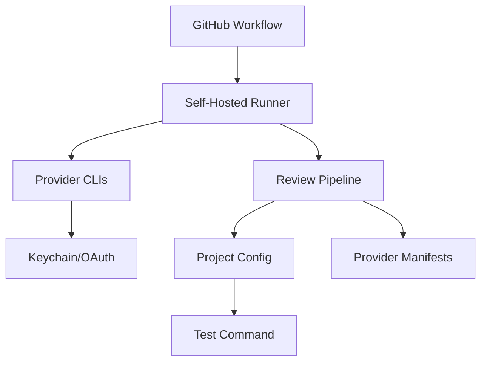
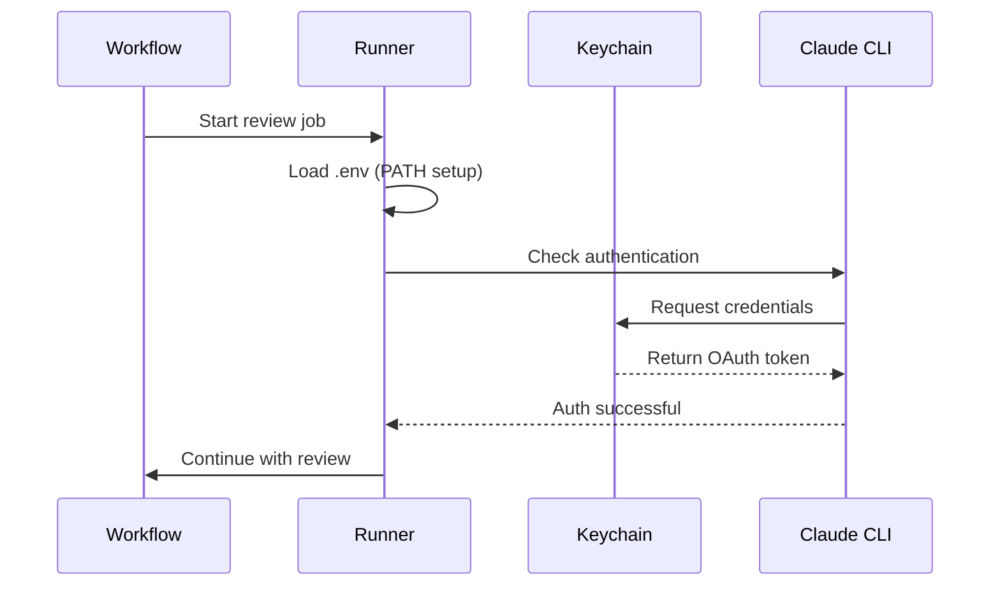

# Migration Guide: From Embedded to Standalone Review Pipeline

This guide covers the complete migration from the embedded `.review-pipeline/` directory to the standalone `@multi-model/review-pipeline` package.

## Table of Contents
1. [Architecture Overview](#architecture-overview)
2. [Current State Analysis](#current-state-analysis)
3. [Migration Steps](#migration-steps)
4. [Runner Configuration](#runner-configuration)
5. [Project Integration](#project-integration)
6. [Verification & Testing](#verification-testing)
7. [Rollback Plan](#rollback-plan)

## Architecture Overview

### Before Migration (Embedded)
```
your-project/
├── .review-pipeline/           # Embedded pipeline (992B of files)
│   ├── lib/                    # Core logic
│   ├── scripts/                # Execution scripts
│   ├── config/                 # Configuration
│   └── package.json            # Dependencies
├── .github/workflows/
│   └── pr-multimodel-review.yml # 357 lines, complex workflow
└── src/                        # Your project code
```

### After Migration (Standalone)
```
your-project/
├── .reviewrc.json              # Project config (50 lines)
├── .review-criteria.md         # Project criteria (optional)
├── .github/workflows/
│   └── pr-review.yml          # Simple workflow (30 lines)
└── src/                       # Your project code

multi-model-review-pipeline/   # Separate package
├── Everything...              # Centralized, versioned, reusable
```

## Current State Analysis

### What You Have Now
1. **Embedded Pipeline**: `.review-pipeline/` directory in each project
2. **Complex Workflow**: 357-line workflow file with all logic
3. **Tight Coupling**: Runner setup mixed with pipeline logic
4. **Authentication**: Keychain-based auth on self-hosted runner

### Dependencies Map


## Migration Steps

### Phase 1: Preparation (No Downtime)

#### 1.1 Verify Extracted Package
```bash
# Check the extracted package is complete
cd ../multi-model-review-pipeline
npm install
npm test

# Test CLI works
./bin/review-pipeline --help
```

#### 1.2 Test Local Execution
```bash
# From your project directory (e.g., pyrepl3)
PROJECT_ROOT=$(pwd) ../multi-model-review-pipeline/bin/review-pipeline run \
  --config .reviewrc.json \
  --providers claude,codex,gemini
```

#### 1.3 Backup Current Setup
```bash
# Create backup of current setup
tar -czf review-pipeline-backup.tar.gz \
  .review-pipeline/ \
  .github/workflows/pr-multimodel-review.yml
```

### Phase 2: Runner Preparation

#### 2.1 Create Runner Repository
```bash
# Create new repository for runner configuration
mkdir ~/github-runner-capsule-config
cd ~/github-runner-capsule-config
git init
```

#### 2.2 Document Current Runner Setup
Create `SETUP.md`:
```markdown
# GitHub Runner Setup for Review Pipeline

## Prerequisites
- macOS (for Keychain authentication)
- Admin access for service installation
- GitHub account with runner access

## Installed CLIs
- Claude Code: ~/.claude/local/claude
- Codex CLI: via npm global
- Gemini CLI: via pip
```

#### 2.3 Create Setup Scripts
```bash
# Create automated setup script
cat > setup-all.sh << 'EOF'
#!/bin/bash
set -euo pipefail

echo "=== Review Pipeline Runner Setup ==="

# 1. Install provider CLIs
./scripts/install-providers.sh

# 2. Configure authentication
./scripts/configure-auth.sh

# 3. Set up environment
./scripts/setup-environment.sh

# 4. Verify installation
./scripts/verify-setup.sh

echo "✅ Setup complete!"
EOF
chmod +x setup-all.sh
```

### Phase 3: Update Project Configuration

#### 3.1 Create New Workflow File
Create `.github/workflows/pr-review-new.yml`:
```yaml
name: PR Multi-Model Review

on:
  pull_request:
    types: [opened, synchronize, reopened]

permissions:
  contents: read
  pull-requests: write

jobs:
  review:
    runs-on: self-hosted
    timeout-minutes: 45
    steps:
      - uses: actions/checkout@v4
        with:
          fetch-depth: 0
      
      # Option A: Use local package (during migration)
      - name: Run Review (Local Package)
        run: |
          ../multi-model-review-pipeline/bin/review-pipeline run \
            --config .reviewrc.json \
            --test-cmd "${{ vars.TEST_CMD }}" \
            --project-root ${{ github.workspace }}
      
      # Option B: Use npm package (after publishing)
      # - uses: multi-model/review-pipeline-action@v1
      #   with:
      #     config-file: .reviewrc.json
      #     test-command: ${{ vars.TEST_CMD }}
```

#### 3.2 Verify Configuration Files
Ensure these files exist:
- `.reviewrc.json` - Project configuration
- `.review-criteria.md` - Project-specific criteria (optional)

### Phase 4: Testing & Validation

#### 4.1 Test New Workflow
```bash
# Create test branch
git checkout -b test-new-review-pipeline

# Make small change
echo "# Test" >> README.md
git add README.md
git commit -m "Test new review pipeline"
git push origin test-new-review-pipeline

# Create PR and verify review runs
```

#### 4.2 Compare Results
```bash
# Compare outputs from old and new pipeline
diff -u .review-pipeline/workspace/summary.md \
        ../multi-model-review-pipeline/workspace/summary.md
```

#### 4.3 Performance Check
- Old pipeline startup: ~5-10 seconds
- New pipeline startup: ~2-3 seconds (no npm install in workflow)

### Phase 5: Cutover

#### 5.1 Update Default Workflow
```bash
# Replace old workflow with new
mv .github/workflows/pr-multimodel-review.yml \
   .github/workflows/pr-multimodel-review.yml.old
mv .github/workflows/pr-review-new.yml \
   .github/workflows/pr-review.yml
```

#### 5.2 Remove Embedded Pipeline
```bash
# After confirming everything works
rm -rf .review-pipeline/
git add -A
git commit -m "chore: migrate to standalone review pipeline package"
```

#### 5.3 Update Documentation
Update your README.md:
```markdown
## Code Review

This project uses the Multi-Model Review Pipeline for automated PR reviews.

Configuration: `.reviewrc.json`
Criteria: `.review-criteria.md`
```

## Runner Configuration

### Directory Structure
```
github-runner-capsule/
├── _work/                      # GitHub runner work directory
├── bin/                        # Runner binaries
├── externals/                  # External tools
├── scripts/
│   ├── fix-claude-auth.sh     # Claude auth workaround
│   ├── start-runner.sh        # Start script
│   └── verify-auth.sh         # Auth verification
├── .credentials                # Runner credentials
├── .env                        # Environment variables
└── .runner                     # Runner configuration
```

### Environment Setup
```bash
# .env file in runner directory
PATH=$HOME/.claude/local:$HOME/github-runner-capsule:$PATH
REVIEW_PARALLEL=true

# No API keys! Uses OAuth/Keychain
unset ANTHROPIC_API_KEY
unset OPENAI_API_KEY
unset GEMINI_API_KEY
```

### Authentication Flow


## Project Integration

### Required Files

#### `.reviewrc.json`
```json
{
  "version": "1.0.0",
  "providers": {
    "claude": {
      "enabled": true,
      "model": "opus",
      "timeout_override": 180
    },
    "codex": {
      "enabled": true,
      "model": "gpt-5"
    },
    "gemini": {
      "enabled": true,
      "model": "gemini-2.5-pro"
    }
  },
  "testing": {
    "enabled": true,
    "command": "pytest tests/",
    "timeout_seconds": 300
  },
  "gating": {
    "enabled": true,
    "must_fix_threshold": 1,
    "severity_thresholds": {
      "critical": 0,
      "high": 1,
      "medium": 5
    }
  }
}
```

#### `.review-criteria.md` (Optional)
```markdown
# Project Review Criteria

<architecture>
- Follow layered architecture
- Maintain separation of concerns
</architecture>

<security>
- No hardcoded credentials
- Input validation required
</security>
```

### Repository Variables
Set in GitHub repository settings:
- `TEST_CMD`: Command to run tests (e.g., `pytest tests/`)
- `REVIEW_TIMEOUT`: Global timeout in seconds
- `ENABLED_PROVIDERS`: Comma-separated list of providers

## Verification & Testing

### Checklist
- [ ] Package extracted successfully
- [ ] CLI works locally
- [ ] Runner has all CLIs installed
- [ ] Authentication works for all providers
- [ ] New workflow file created
- [ ] Configuration files in place
- [ ] Test PR runs successfully
- [ ] Results match previous pipeline
- [ ] Old pipeline removed
- [ ] Documentation updated

### Test Commands
```bash
# 1. Test package CLI
../multi-model-review-pipeline/bin/review-pipeline --version

# 2. Test auth check
../multi-model-review-pipeline/bin/review-pipeline auth-check

# 3. Test configuration validation
../multi-model-review-pipeline/bin/review-pipeline validate \
  --config .reviewrc.json

# 4. Test full review locally
PROJECT_ROOT=$(pwd) ../multi-model-review-pipeline/bin/review-pipeline run

# 5. Check generated reports
ls -la ../multi-model-review-pipeline/workspace/reports/
```

### Success Metrics
- ✅ All providers authenticate successfully
- ✅ Reviews complete in < 10 minutes
- ✅ Gate status correctly determined
- ✅ PR comments posted successfully
- ✅ No API keys in environment

## Rollback Plan

If issues arise, rollback is simple:

### Quick Rollback
```bash
# 1. Restore old workflow
mv .github/workflows/pr-review.yml \
   .github/workflows/pr-review-new.yml
mv .github/workflows/pr-multimodel-review.yml.old \
   .github/workflows/pr-multimodel-review.yml

# 2. Restore embedded pipeline (if deleted)
tar -xzf review-pipeline-backup.tar.gz

# 3. Commit rollback
git add -A
git commit -m "revert: rollback to embedded review pipeline"
git push
```

### Gradual Rollback
Keep both workflows active with different triggers:
```yaml
# Old workflow - for production
on:
  pull_request:
    branches: [main, master]

# New workflow - for testing
on:
  pull_request:
    branches: [feature/*, test/*]
```

## Common Issues & Solutions

### Issue: "Provider not authenticated"
```bash
# On runner machine
claude /login  # Interactive auth
codex auth login
gemini auth login
```

### Issue: "Command not found: review-pipeline"
```bash
# Install package globally
npm install -g @multi-model/review-pipeline

# Or use full path
/full/path/to/multi-model-review-pipeline/bin/review-pipeline
```

### Issue: "No reviews generated"
Check:
1. Runner environment has PATH set correctly
2. Authentication is valid (not expired)
3. No API key variables set (must use OAuth)
4. Workspace directory has write permissions

### Issue: "Different results from old pipeline"
This is expected for:
- Timestamp differences
- Minor formatting changes
- Provider model updates

Not expected for:
- Missing issues
- Different severity ratings
- Failed gate status when should pass

## Timeline Estimate

- **Phase 1 (Preparation)**: 1 hour
- **Phase 2 (Runner Setup)**: 2 hours
- **Phase 3 (Project Config)**: 30 minutes
- **Phase 4 (Testing)**: 1-2 hours
- **Phase 5 (Cutover)**: 30 minutes

**Total**: 4-6 hours (including testing and verification)

## Support & Resources

- Package Repository: `github.com/multi-model/review-pipeline`
- Runner Setup: `github.com/yourusername/github-runner-capsule-config`
- Issues: Create issue in respective repository
- Documentation: See README.md in each repository

## Next Steps

After successful migration:
1. **Publish Package**: `npm publish` the review pipeline
2. **Document Runner**: Complete runner setup documentation
3. **Update Other Projects**: Migrate other repositories
4. **Monitor Performance**: Track execution times and success rates
5. **Iterate**: Improve based on usage patterns